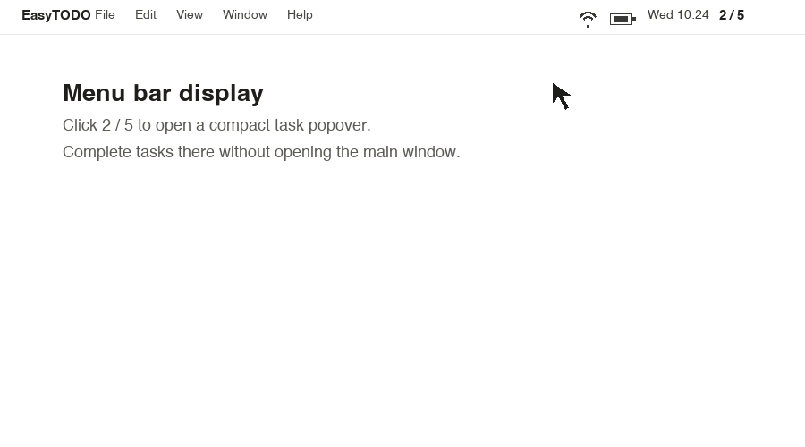

<div align="center">
  
  <h1>EasyTODO: The simplest free TODO list for macOS.</h1>
  <h2><strong>Simple. Free. Always on your desktop. MacOS 14 or above.</strong></h2>
  <p>
    <a href="https://github.com/ArabelaTso/easytodo-on-macos/releases/latest"></a>
    
    
    
    
    
  </p>
  <p><code>capture -> prioritize -> complete -> stay in flow</code></p>
</div>

EasyTODO is a native macOS desktop todo app designed to stay visible, feel lightweight, and make capture fast. It removes the tedious setup common in task apps: no workspace setup, no cloud account, no project-management ceremony. Just today's tasks, always close at hand.


## Download

[Download the latest macOS DMG](https://github.com/ArabelaTso/easytodo-on-macos/releases/latest)

- Requires macOS 14 or later.
- Download `EasyTODO-*-macOS-arm64.dmg`, open it, then drag `EasyTODO.app` to `Applications`.
- If macOS blocks the first launch, right-click `EasyTODO.app` and choose `Open`.

## Why EasyTODO

Most todo apps make a simple thought feel like admin work: open a tab, pick a workspace, choose a project, fill metadata, then find the list again later. **EasyTODO is built to remove that friction**. It behaves like a polished desktop note that can float above your work, save locally, and accept new tasks without breaking your flow.

- **Desktop-first:** keep your list visible in a compact floating window or smaller desktop widget.
- **Fast capture:** add tasks from the bottom row, header popover, or global Quick Add.
- **Local-first:** SwiftData persists tasks on your Mac automatically.
- **Low friction:** fewer steps to capture, prioritize, complete, and review tasks.
- **Native macOS feel:** SwiftUI, AppKit window behavior, materials, and keyboard shortcuts.

## Features

### Shortcut Key


- Press `Command + "+"` from any app to open a translucent Quick Add input on the current screen.
- Type a task and press `Return`; EasyTODO saves it to today's list without switching context.
- Use the top-right `+` or bottom `Add Task` row when you are already in the main window.
- Press `Esc` or click outside Quick Add to dismiss it; if the shortcut is unavailable, EasyTODO falls back to `Option + Command + N`.


### Organize, Prioritize, Complete

- Add, complete, delete, reorder, restore, and double-click to edit tasks inline.
- Completed tasks are separated from active tasks; newly completed tasks move to the top of the completed group.
- Completion plays a system sound and shows a small fireworks effect.
- Tasks use four clean priority colors while keeping the left row color strip visible.

| Color | Meaning |
| --- | --- |
| Red | Important and urgent |
| Yellow | Urgent but not important |
| Green | Important but not urgent |
| Gray | Neither urgent nor important |

New tasks default to green. The UI shows a single color dot picker instead of written priority names.

### Menu Bar And Widget



- Show today's progress in the macOS menu bar, such as `2 / 5`, and open a compact task popover.
- Toggle completion directly from the menu bar popover without opening the full app.
- Open a draggable desktop widget from the app menu, menu bar popover, or main window context menu.
- The widget floats above the desktop, joins all Spaces, shows active/done counts, and opens the full app on double-click.

### Planning, Window Control, Persistence

- Click the date header to open calendar planning; legacy unscheduled tasks are normalized to today.
- Right-click the main window to change always-on-top, transparency, or widget mode.
- Choose 100%, 80%, or 50% transparency levels.
- SwiftData autosaves edits, app deactivation, and termination into the user's Application Support directory.

## Installation

Download the latest macOS DMG from GitHub Releases:

[Download EasyTODO for macOS](https://github.com/ArabelaTso/easytodo-on-macos/releases/latest)

1. Download `EasyTODO-*-macOS-arm64.dmg`.
2. Open the DMG.
3. Drag `EasyTODO.app` into `Applications`.
4. If macOS blocks the first launch, right-click `EasyTODO.app` and choose `Open`.

Requires macOS 14 or later.

## Usage

1. Launch EasyTODO from `Applications`.
2. Add a task from the bottom `Add Task` row, the top-right `+`, or global Quick Add.
3. Use the color dot to set priority.
4. Check a task to complete it; EasyTODO plays a sound and shows a small celebration.
5. Open the desktop widget from the app menu, menu bar popover, or main window context menu when you want a smaller view.
6. Right-click the window to change always-on-top, transparency, or widget mode.
7. Open Settings to manage launch, menu bar, visibility, transparency, and theme.

## Keyboard Shortcuts

| Shortcut | Action |
| --- | --- |
| `Command + +` | Global Quick Add |
| `Option + Command + N` | Fallback global Quick Add |
| `Command + N` | Focus new task entry |
| `Control + Z` | Undo last deleted task |
| `Return` | Save active quick input |
| `Esc` | Dismiss active quick input |

## Settings

| Setting | Options |
| --- | --- |
| Launch at Login | On / Off |
| Always on Top | On / Off |
| Show in Menu Bar | On / Off |
| Hide Dock Icon | On / Off when menu bar is enabled |
| Transparency | 100%, 80%, 50% |
| Theme | Light, Dark |

## Project Structure

```text
Sources/EasyTODO/
├── App/                 # App entry, settings keys, notifications
├── Components/          # Reusable UI pieces and visual effects
├── Managers/            # AppKit integration: windows, shortcuts, menu bar, login
├── Models/              # SwiftData models and task ordering
├── Persistence/         # SwiftData container setup and store migration
├── Resources/           # Bundled app logo
└── Views/               # Main list, task row, quick add, calendar, settings
Tests/EasyTODOTests/     # XCTest coverage
```

## Technology

| Area | Implementation |
| --- | --- |
| UI | SwiftUI |
| Persistence | SwiftData |
| Settings | AppStorage / UserDefaults |
| Window behavior | AppKit NSWindow / NSPanel |
| Menu bar | AppKit status item and popover |
| Desktop widget | Borderless AppKit NSPanel with SwiftUI content |
| Global shortcut | Carbon hot key registration |
| Login item | ServiceManagement |

## Release Notes

Reverse chronological history, based on Git commits.

| Commit | Tag | Notes |
| --- | --- | --- |
| `67d0e54` |  | Added macOS app packaging, DMG generation, and GitHub release automation. |
| `1f5150d` |  | Added compact desktop widget mode. |
| `a321623` |  | Updated the README product guide. |
| `b4d7de0` |  | Updated transparency options. |
| `e239fe9` |  | Added menu bar context actions. |
| `2ff65a7` |  | Fixed focus behavior for the bottom Add Task row. |
| `02fca2f` |  | Added the top-right header quick task input. |
| `a7dca6a` |  | Added inline task title editing. |
| `51d441e` |  | Added context controls for window behavior and delete undo. |
| `4e30bdc` |  | Removed the System theme option; kept Light and Dark. |
| `d2593de` |  | Added the global Quick Add panel. |
| `f2fca4a` |  | Moved window controls into a context menu. |
| `944662e` |  | Removed the main window titlebar for a cleaner note shape. |
| `e58169e` |  | Polished the window background and app icon. |
| `2921750` |  | Added calendar-based task scheduling. |
| `d436ba5` |  | Renamed the app to EasyTODO. |
| `0e43f20` |  | Ordered completed tasks by completion sequence. |
| `5b28279` |  | Added completion sound and visual feedback effects. |
| `1d1d063` |  | Improved note-style window behavior and local persistence. |
| `992cd8f` |  | Refined the priority color picker. |
| `c86d54d` |  | Implemented the first native desktop todo app. |
| `fdd9267` |  | Reformulated README into a structured product document. |
| `5bd2978` |  | Added the first README introduction. |
| `1eb8947` |  | Initial repository setup. |

## Contributing

Contributions are welcome. Keep changes focused and native to macOS.

```sh
swift build
swift test
```

For UI changes, include a screenshot or short GIF. For persistence, ordering, or model changes, add or update XCTest coverage.

## License

This project is licensed under the terms in [LICENSE](LICENSE).
