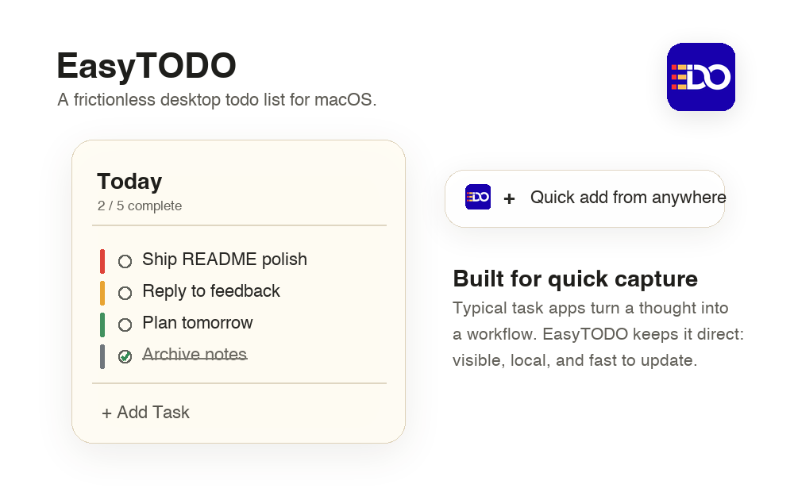
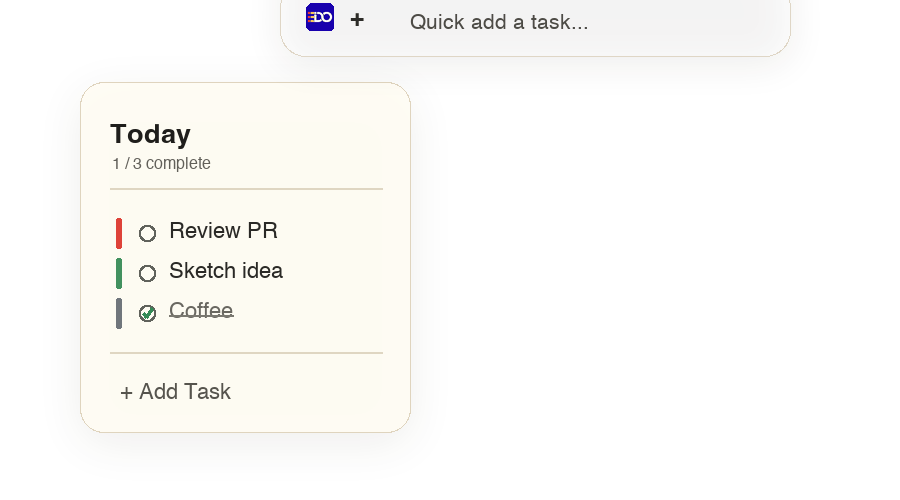

# EasyTODO

EasyTODO is a lightweight macOS desktop todo app designed to stay visible, feel native, and make capture fast. It removes the tedious setup common in task apps: no workspace setup, no cloud account, no project-management ceremony. Just today's tasks, always close at hand.



## Why EasyTODO

Most todo apps make a simple thought feel like admin work: open a tab, pick a workspace, choose a project, fill metadata, then find the list again later. EasyTODO is built to remove that friction. It behaves like a polished desktop note that can float above your work, save locally, and accept new tasks without breaking your flow.

- **Desktop-first:** keep your list visible in a compact floating window.
- **Fast capture:** add tasks from the bottom row, header popover, or global Quick Add.
- **Local-first:** SwiftData persists tasks on your Mac automatically.
- **Low friction:** fewer steps to capture, prioritize, complete, and review tasks.
- **Native macOS feel:** SwiftUI, AppKit window behavior, materials, and keyboard shortcuts.

## Preview



## Features

### Task Management

- Add, complete, delete, reorder, and restore tasks.
- Double-click a task title to edit inline; clicking elsewhere saves the edit.
- Completed tasks are separated from active tasks and newest completions move to the top of the completed group.
- Delete confirmation helps avoid accidental removal; undo delete is available from the app command and context menu.

### Priority Colors

Tasks use four clean color markers instead of verbose labels:

| Color | Meaning |
| --- | --- |
| Red | Important and urgent |
| Yellow | Urgent but not important |
| Green | Important but not urgent |
| Gray | Neither urgent nor important |

New tasks default to green. The UI shows a single color dot picker and keeps the row color strip visible.

### Quick Add

- **Global Quick Add:** press `Command + "+"` (or `Command + Shift + "+"`) to open a translucent input on the current screen. If that shortcut is unavailable, EasyTODO falls back to `Option + Command + N`.
- **Header Quick Add:** click the `+` in the top-right of the main window to open a compact rounded input.
- **Bottom Add Row:** click `Add Task` at the bottom of the window and type directly.
- Press `Return` to save, or `Esc` to dismiss quick inputs.

### Calendar Planning

Click the date header to open the calendar planner. Tasks can be scheduled by day, and legacy unscheduled tasks are normalized to today so existing data remains visible.

### Desktop Window Controls

- Always-on-top mode.
- 100%, 90%, and 80% transparency levels.
- Window close, minimize, and zoom controls moved into a subtle context menu.
- Right-click the main window to adjust window behavior quickly.

### Feedback and Persistence

- Completion sound and a small fireworks effect when a task is completed.
- Autosave on edits, app deactivation, and termination.
- Data is stored in the user's Application Support directory via SwiftData.

### Menu Bar

EasyTODO can show progress in the macOS menu bar, such as `2 / 5`, and provide quick access to today's tasks.

## Installation

### Requirements

- macOS 14 or later
- Xcode command line tools
- Swift Package Manager with Swift tools 6.0 support

### Run From Source

```sh
git clone <this-repository-url>
cd my-desktop-todo
swift run EasyTODO
```

### Build

```sh
swift build
```

### Build a Release Binary

```sh
swift build -c release
.build/release/EasyTODO
```

### Test

```sh
swift test
```

## Usage

1. Launch EasyTODO with `swift run EasyTODO`.
2. Add a task from the bottom `Add Task` row, the top-right `+`, or global Quick Add.
3. Use the color dot to set priority.
4. Check a task to complete it; EasyTODO plays a sound and shows a small celebration.
5. Right-click the window to change always-on-top or transparency.
6. Open Settings to manage launch, menu bar, visibility, transparency, and theme.

## Keyboard Shortcuts

| Shortcut | Action |
| --- | --- |
| `Command + +` | Global Quick Add |
| `Option + Command + N` | Fallback global Quick Add |
| `Command + N` | Focus new task entry |
| `Control + Z` | Undo last deleted task |
| `Return` | Save active quick input |
| `Esc` | Dismiss active quick input |

## Settings

| Setting | Options |
| --- | --- |
| Launch at Login | On / Off |
| Always on Top | On / Off |
| Show in Menu Bar | On / Off |
| Hide Dock Icon | On / Off when menu bar is enabled |
| Transparency | 100%, 90%, 80% |
| Theme | Light, Dark |

## Project Structure

```text
Sources/EasyTODO/
├── App/                 # App entry, settings keys, notifications
├── Components/          # Reusable UI pieces and visual effects
├── Managers/            # AppKit integration: windows, shortcuts, menu bar, login
├── Models/              # SwiftData models and task ordering
├── Persistence/         # SwiftData container setup and store migration
├── Resources/           # Bundled app logo
└── Views/               # Main list, task row, quick add, calendar, settings
Tests/EasyTODOTests/     # XCTest coverage
```

## Technology

| Area | Implementation |
| --- | --- |
| UI | SwiftUI |
| Persistence | SwiftData |
| Settings | AppStorage / UserDefaults |
| Window behavior | AppKit NSWindow / NSPanel |
| Menu bar | AppKit status item and popover |
| Global shortcut | Carbon hot key registration |
| Login item | ServiceManagement |

## Release Notes

Chronological history, based on Git commits.

| Date | Commit | Tag | Notes |
| --- | --- | --- | --- |
| 2026-08-05 | `1eb8947` | chore | Initial repository setup. |
| 2026-08-05 | `5bd2978` | docs | Added the first README introduction. |
| 2026-08-05 | `fdd9267` | docs | Reformulated README into a structured product document. |
| 2026-08-05 | `c86d54d` | feature | Implemented the first native desktop todo app. |
| 2026-08-05 | `992cd8f` | feature | Refined the priority color picker. |
| 2026-08-05 | `1d1d063` | feature | Improved note-style window behavior and local persistence. |
| 2026-08-05 | `5b28279` | feature | Added completion sound and visual feedback effects. |
| 2026-08-05 | `0e43f20` | feature | Ordered completed tasks by completion sequence. |
| 2026-08-05 | `d436ba5` | chore | Renamed the app to EasyTODO. |
| 2026-08-05 | `2921750` | feature | Added calendar-based task scheduling. |
| 2026-08-05 | `e58169e` | ui | Polished the window background and app icon. |
| 2026-08-05 | `944662e` | ui | Removed the main window titlebar for a cleaner note shape. |
| 2026-08-05 | `f2fca4a` | ui | Moved window controls into a context menu. |
| 2026-08-05 | `d2593de` | feature | Added the global Quick Add panel. |
| 2026-08-05 | `4e30bdc` | ui | Removed the System theme option; kept Light and Dark. |
| 2026-08-05 | `51d441e` | feature | Added context controls for window behavior and delete undo. |
| 2026-08-05 | `a7dca6a` | feature | Added inline task title editing. |
| 2026-08-05 | `02fca2f` | feature | Added the top-right header quick task input. |
| 2026-08-05 | `2ff65a7` | fix | Fixed focus behavior for the bottom Add Task row. |

## Contributing

Contributions are welcome. Keep changes focused and native to macOS.

```sh
swift build
swift test
```

For UI changes, include a screenshot or short GIF. For persistence, ordering, or model changes, add or update XCTest coverage.

## License

This project is licensed under the terms in [LICENSE](LICENSE).
